🍕 Pizza Sales SQL Analysis

📌 Objective
Analyze pizza sales data using SQL to extract insights on revenue, customer behavior, and product performance.

🛠 Tools Used
- MySQL
- MySQL Workbench
- GitHub

'''
📂 Project Structure
pizza-sales-sql-analysis/
│
├── results/
│   ├── total_orders.png
│   ├── total_revenue.png
│   ├── highest_priced_pizza.png
│   ├── most_common_size.png
│   ├── top_5_pizzas.png
│   ├── peak_hours.png
│   ├── category_distribution.png
│   ├── avg_orders_per_day.png
│   ├── top_revenue_pizzas.png
│   ├── category_contribution.png
│   ├── cumulative_revenue.png
│   ├── top_pizzas_by_category.png
│
├── pizza_analysis.sql
└── README.md

'''
---------------- Basic Analysis -------------------------

1) Total Number of Orders
Query Purpose: Count total orders placed.

📸 Image file: "results/total_orders.png"
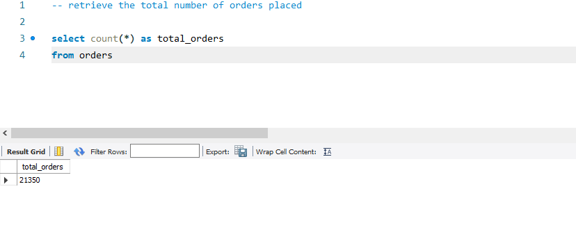

Insight: Represents overall demand and transaction volume.

2) Total Revenue
Query Purpose: Calculate total revenue from all pizza sales.

📸 Image file: "results/total_revenue.png"
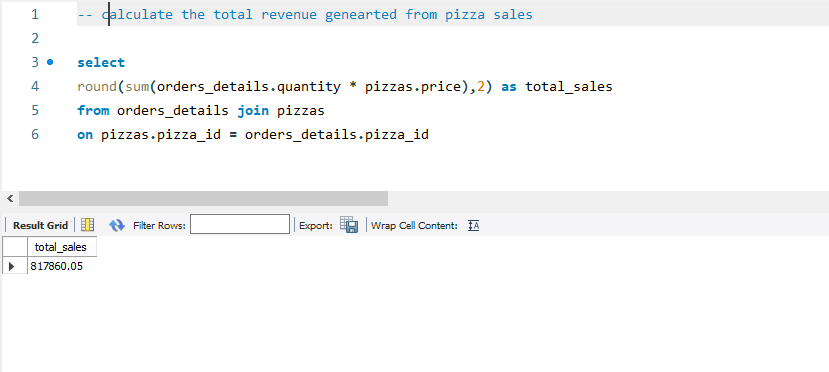

Insight: Indicates total earnings and business performance.

3) Highest Priced Pizza
Query Purpose: Identify the most expensive pizza on the menu.

📸 Image file: "results/highest_priced_pizza.png"
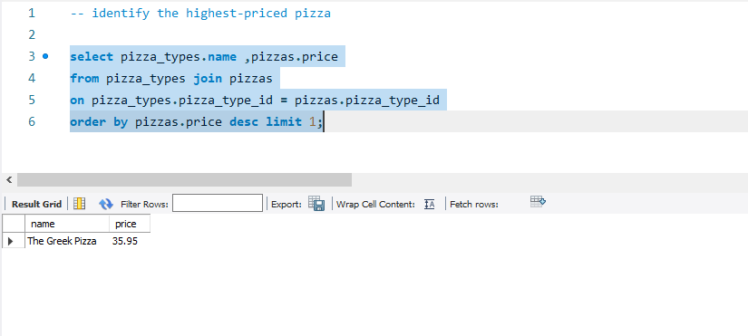

Insight: Premium products contribute higher revenue per order.

4) Most Common Pizza Size
Query Purpose: Find the most frequently ordered pizza size.

📸 Image file: "results/most_common_size.png"
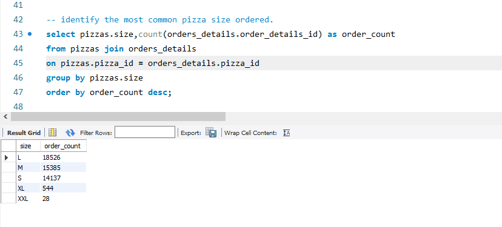

Insight: Helps in stock and inventory planning.

5) Top 5 Most Ordered Pizzas
Query Purpose: Retrieve most popular pizzas based on quantity.

📸 Image file: "results/top_5_pizzas.png"
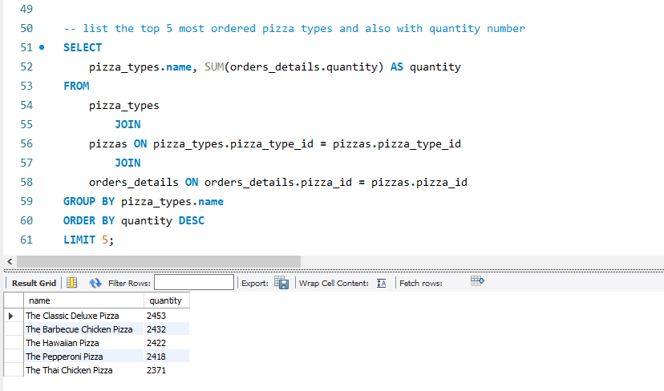

Insight: These pizzas are key drivers of sales volume.

---------- Intermediate Analysis ---------------------------

6) Orders by Hour (Peak Time)

Query Purpose: Analyze order distribution across different hours.

📸 Image file: "results/peak_hours.png"
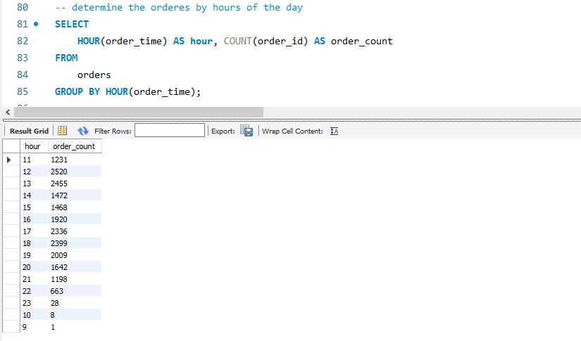

Insight: Peak demand occurs in evening hours (dinner time).

7) Category-wise Distribution
Query Purpose: Count pizzas across categories.

📸 Image file: "results/category_distribution.png"
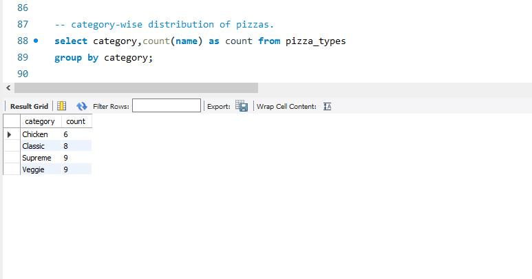

Insight: Shows variety and demand across categories.

8) Average Orders Per Day
Query Purpose: Calculate average pizzas ordered per day.

📸 Image file: "results/avg_orders_per_day.png"
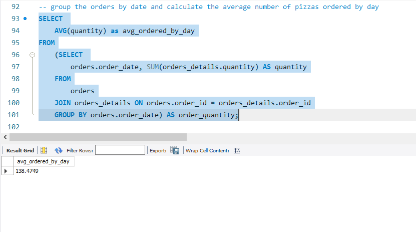

Insight: Helps understand daily demand trends.

 9) Top 3 Pizzas by Revenue
Query Purpose: Identify highest revenue-generating pizzas.

📸 Image file: "results/top_revenue_pizzas.png"
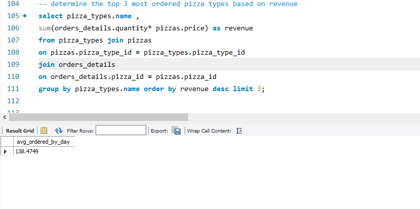

Insight: High-value products contribute most to revenue.

--------- Advanced Analysis ---------

10) Revenue Contribution by Category
Query Purpose: Calculate percentage contribution of each category.

📸 Image file: "results/category_contribution.png"
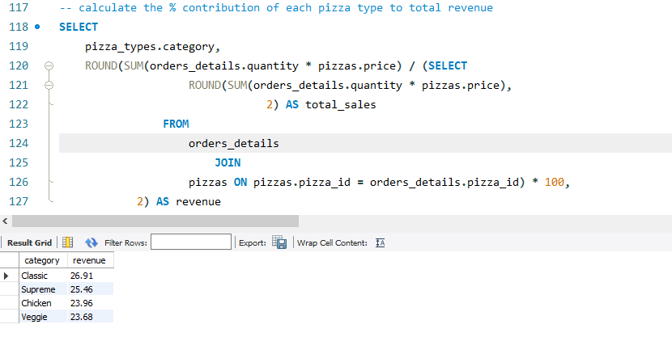

Insight: Identifies dominant revenue-generating categories.

11) Cumulative Revenue Over Time
Query Purpose: Track running total of revenue.

📸 Image file: "results/cumulative_revenue.png"
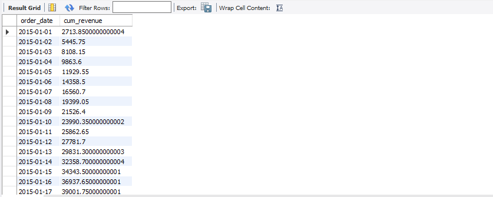

Insight: Shows business growth trend over time.

12) Top 3 Pizzas by Category
Query Purpose: Find best pizzas within each category.

📸 Image file: "results/top_pizzas_by_category.png"
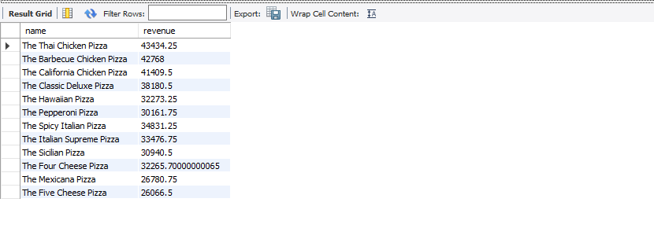

Insight: Helps optimize category-level product strategy.

📈 Conclusion

This project demonstrates how SQL can be used to extract meaningful insights from business data, helping in decision-making such as inventory planning, peak-hour management, and revenue optimization.
